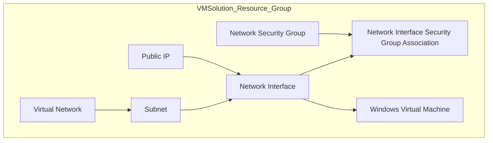

# Terraform Azure VM Setup

## Overview
This terraform project scaffolds an azure virtual machine environment with network security configured.


## Architecture Diagram



## Pre-requisite

Before you begin, ensure you have the following:

1. An active Azure subscription.
2. Terraform installed on your local machine. You can download it from [here](https://www.terraform.io/downloads.html).
3. Azure CLI installed on your local machine. You can download it from [here](https://docs.microsoft.com/en-us/cli/azure/install-azure-cli).
4. Git installed on your local machine. You can download it from [here](https://git-scm.com/downloads).

## Installation

To be able to use this solution, follow these steps:

1. Clone the repository:
    ```sh
    git clone https://github.com/froxtrox/TerraformNetworkingSolutionSamples.git
    ```

2. Create a blob storage container for safe storage of the Terraform backend:

    Open a command line prompt with Azure CLI installed, and execute the following scripts:
    ```sh
    az group create -l <your_azure_location> -n <your_resource_group_name>
    az storage account create -n <your_storage_account_name> -g <your_resource_group_name>
    az storage container create -n <your_container_name> --account-name <your_storage_account_name>
    ```

3. Navigate to the project directory:
    ```sh
    cd TerraformNetworkingSolutionSamples/Virtual Machine
    ```

4. Configure the Terraform backend:

    Open the `main.tf` file in the project directory and populate the following section with your Azure storage details using the values from step 2:
    ```hcl
    terraform {
      backend "azurerm" {
        container_name       = "<CONTAINER_NAME>"
        key                  = "<KEY>"
        resource_group_name  = "<RESOURCE_GROUP_NAME>"
        storage_account_name = "<STORAGE_ACCOUNT_NAME>"
      }
    }
    ```
5. Configure the `terraform.tfvars` file to set the following values:

    ```hcl
    subscription_id = "<YOUR_SUBSCRIPTION_ID>"
    prefix          = "<RESOURCE_PREFIX>"
    tags_vmgroup    = "<TAGS_VM_GROUP>"
    location        = "<LOCATION>"
    admin_username  = "<ADMIN_USERNAME>"
    admin_password  = "<ADMIN_PASSWORD>"
    vm_size         = "<VM_SIZE>"
    os_disk_name    = "<OS_DISK_NAME>"
    ```

## Usage

1. Authenticate with Azure and initialize Terraform:
    ```sh
    az login
    terraform init
    ```

2. Plan and apply the Terraform configuration:
    ```sh
    terraform plan
    terraform apply
    ```
